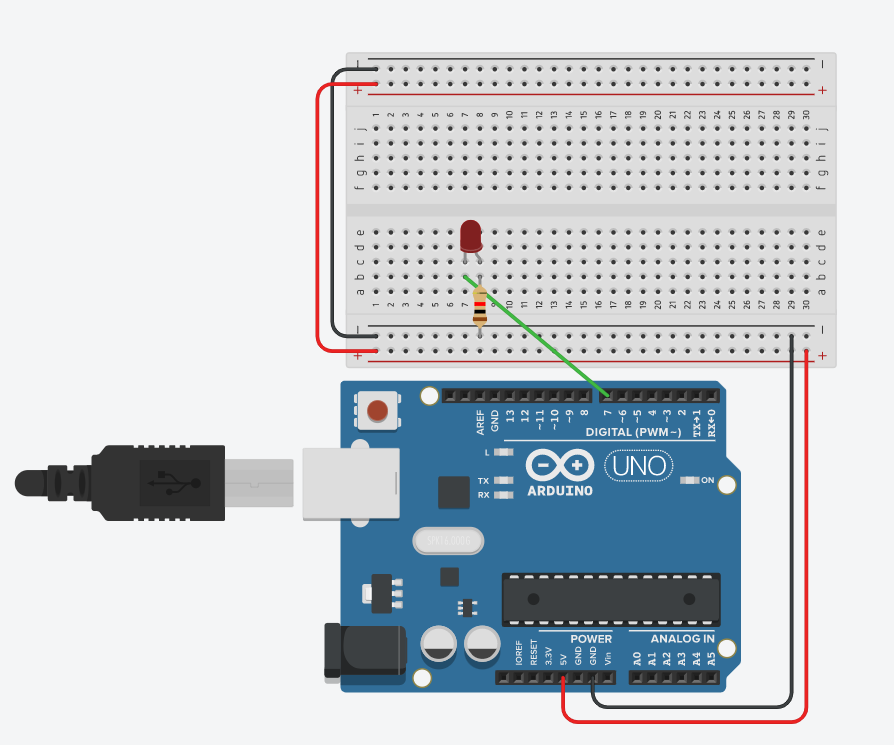

## Dokumentasjon av et prosjekt

### Tips:
* Sjekk "Preview" på siden av "Edit file", det gir deg raskt oversikt over om det blir skrevet riktig
* Sjekk tutorial på [https://www.markdowntutorial.com/lesson/1/](https://www.markdowntutorial.com/lesson/1/)
* Pass på mellomrom! Vises det feil, kan du fjerne mellomrom eller legge til et ekstra og teste om det stemmer bedre da
* Tutorialen viser deg hvordan du lager
  * _italic_, **bold** og **_begge_** formatene
  * # Overskrift1 til 
  * ###### Overskrift 6
  * Lenker med klammeparentes med lenketeksten[] og parentes med nettadressen (), for eksempel kan du skrive [lenker](www.elvebakken.vgs.no) til Elvebakken vgs eller anner
  * Lenker internt i dokumentet, for eksempel til [slutten](#slutten) men husk å skrive #slutten uten mellomrom og kun små bokstader dersom det er en overskrift som heter ## Slutten
  * Bilder i dokumentet, for eksempel kretsene som er koblet i Arduino-prosjektet 
  * Lister der hvert element starter med * og listen kan ha flere nivåer
    * Der hvert nye nivå starter med to mellomroms innrykk fra forrige nivå
      * Dette kan foregå i mange ledd
        * TIl du går lei

### Dokumentasjonen skal inneholde følgende overskrifter
* Liste med filer
* Beskrivelse
* Bruk: Må filen ligge et bestemt sted, hva gjør programmet, hva kan du endre, hva må importeres/inkluderes av eksterne biblioteker?
* Klasser, metoder, funksjoner, variabler: gi en forklaring av det du har produsert
* Elektronikk og koblinger (for Arduino)

Bruk gjerne Markdown-formatet til å lage lenker

Her er ordet [lenke](www.vg.no) lenke til vg.no

Eksempel på løsning av oppgave

## Dokumentasjon av Arduinoprosjektet

## Introduksjon
Vi har i lengre tid jobbet med et prosjekt der mikrokontrolleren Arduino styrer elektronikk som utfører et type arbeid som gode roboter skal gjøre. Her kommer dokumentasjonen av dette prosjektet

Vi har følgende filer som inneholder kode
* arduinoCar.ino
* Kodegenet.h
* Kodegenet.cpp

### ArduinoCar.ino
Dette programmet har følgende metoder i tillegg til void setup() og void loop()
* void forward(int speed, boolean backward)
  * Tar to argumenter int speed og boolean backward. 
* void turn(int degrees, boolean left)
  * Tar to argumenter: int degrees og boolean left 

### KodegenetKortet.h
Denne header-filen gir en oversikt over klassen Kodegenet og har alt av innhold.

### KodegenetKortet.cpp
Denne filen er implementeringen av klassen, meetodene og funksjonene i Kodegenet.h filen

# Slutten 
